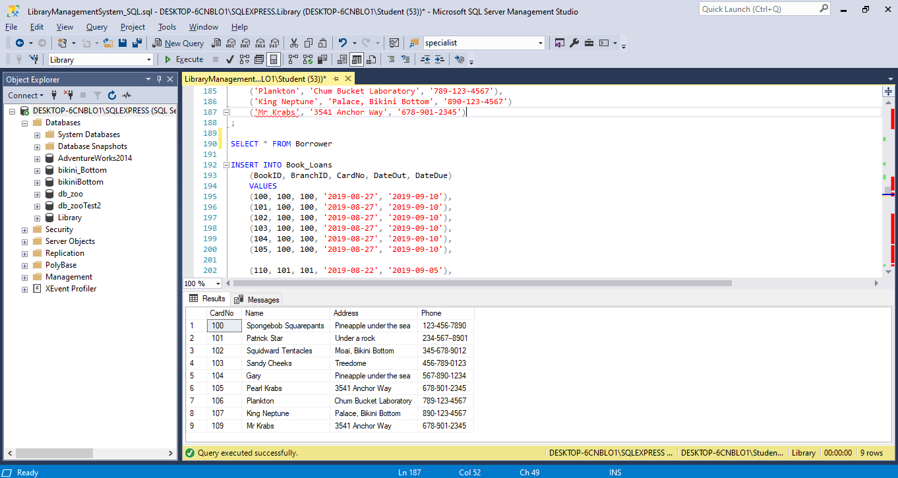

# Library Management System 
I created a Library Management System. It is meant to automate activities such as keeping records of users, books loaned out, as well as books due on a particular day. I also prepopulated the database with information about library branches, users, books and current book loans.

## Tech used
For this project, I utilised SQL(Structured Query Language). It was built with Visual Studio.

## Features
This system utilises a relational database. I created several tables that were necessary in a library management system: Library_Branch, Publisher, Books, Book_Authors, Book_Copies, Borrower and Book_Loans. They were linked using foreign keys.

I then seeded the database to provide an initial set of data to the database so that any stored procedures written could be effectively tested.

Lastly I created stored procedures to add functionality to the system. Through these stored procedures, one could do various things like check the number of copies of a particular book owned by the library branches, find out how many books have been loaned out and which books were due that particular day. The complete list of stored procedures available can be viewed in the [SQLcodingProjects folder](https://github.com/dhavap/SQL/tree/master/SQLcodingProjects).

